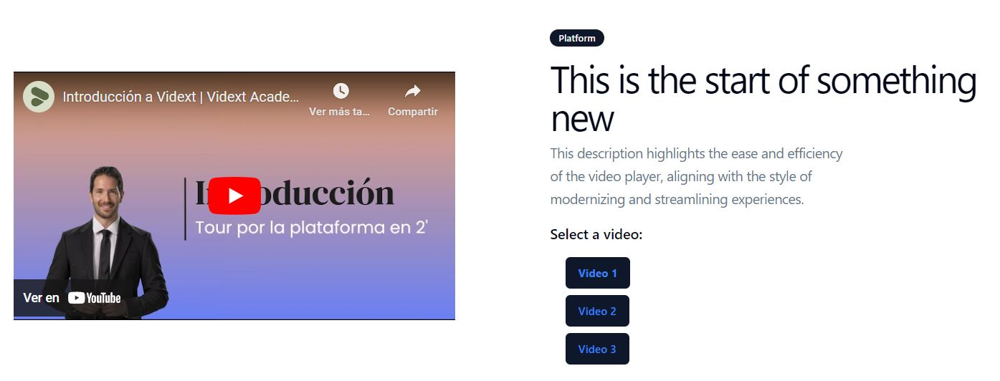

# Create T3 App

This is a [T3 Stack](https://create.t3.gg/) project bootstrapped with `create-t3-app`.

# Video Player

## Overview

This project is a Next.js application that features a custom video player with various controls. The video player integrates with the YouTube API to fetch and display video details.

## Installation

To get started with the project, follow these steps:

1.  **Clone the Repository**

    ```bash
    git clone https://github.com/yourusername/video-player.git
    cd video-player
    ```

2.  **Install Dependencies**
    Ensure you have Node.js and npm (or yarn) installed. Then, run the following command to install the necessary dependencies:

        npm install
        # or
        yarn install

3.  **Set Up Environment Variables**

Rename the .env.example file to .env:

Open the .env file and add your YouTube API key. You need to obtain this key from the Google Developers Console. Add it as follows:

    NEXT_PUBLIC_YOUTUBE_API_KEY=your_youtube_api_key_here

4.  **Running the Project Locally**

    ```bash
    npm run dev
    # or
    yarn dev
    ```

## Example


